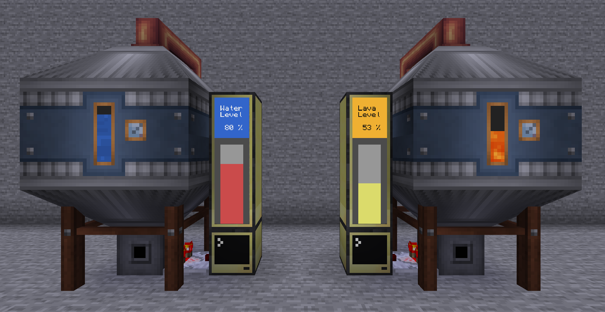

## Container Level Display
A generic vertical-bar style display for tanks and other containers that support redstone comparators.  
Display text, colors and color thresholds are fully configurable.  

<br>

### Default setup with Immersive Engineering fluid tanks:


<br>

### Customized setup with inventories:


<br>

### Installation:
1. Craft a computer and exactly 3 monitors
2. Place the computer so the comparator feeds into it on any side
3. Place the monitors above one another and so one of them also touches the computer
4. Run the following commands in the computer:
```
label set container_level
pastebin get SASvsZb6 startup.lua
edit startup.lua
```
5. Edit the values at the top to your needs
6. Press <kbd>Ctrl</kbd>, select `[Save]` and press <kbd>Enter</kbd>, then press <kbd>Ctrl</kbd> again, select `[Exit]` and press <kbd>Enter</kbd>  
7. Run the command `reboot` to start the program
