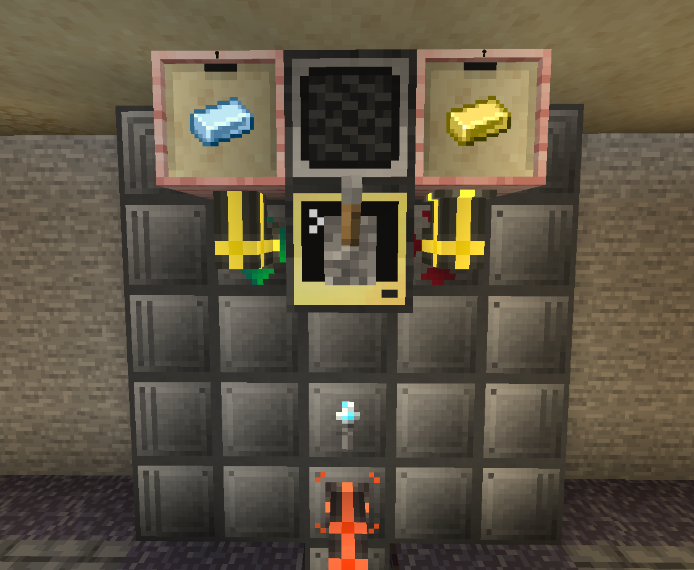

## ReactorAlarm
Program that sounds an alarm when the fuel level of a reactor is low.  
It also incudes a mute lever to silence the alarm while you're working on refueling.  

<br>



<br>

In this picture, the reactor redstone port is behind the computer.

<br>

### Notes:

- While setting the trigger value of the redstone port behind the computer, keep in mind your reactor's total fuel volume, consumption rate and how much time you want to give yourself to refuel it.  
  Mine has a volume of 64B and consumption of 0.075mB/t, so I set the trigger value to 50B to give myself ample time to refuel it.
- The pitch values of the alarm melody can go from 1 to 24, with 1 being an F#

<br>

### Installation:
1. Craft a computer and place it like shown in the image above, in front of a redstone port
2. Run these commands:
```
label set reactor_alarm
pastebin get 29uGV7p6 startup.lua
edit startup.lua
```
3. Change the settings at the top of the file to match your setup or to change the alarm melody
4. Press <kbd>Ctrl</kbd>, select `[Save]` and press <kbd>Enter</kbd>, then press <kbd>Ctrl</kbd> again, select `[Exit]` and press <kbd>Enter</kbd>  
5. Now run the command `reboot` to automatically start the program
