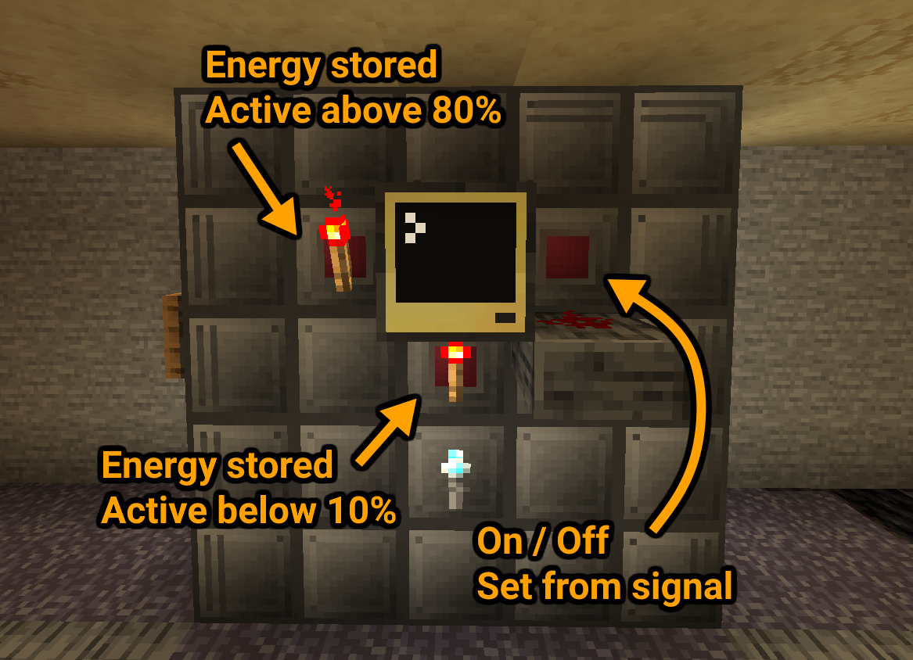

## ReactorControl
This program controls an ExtremeReactors reactor with little efficiency loss in the form of a set/reset latch.  
It doesn't change control rod settings and works by only turning the reactor on or off at set internal battery levels.  

<br>



<br>

### Notes:

- The percentages shown in the image above are the recommended settings but if you have a big reactor with a much higher reactivity you might want to lower the reset signal's trigger percentage on the left side, because the reactor will produce more energy while it's turned off for a short while.  
  Inversely if you want to min-max or have a smaller reactor you might want to increase the reset signal's trigger percentage and decrease the set signal percentage on the bottom side.  
  
- If you want to tidy it up a bit more, you can set the `OUTPUT` variable to `back` and place the redstone port that controls whether the reactor is on or off on the back of the computer.  
  Then, for symmetry, move the set signal at the bottom to the right side of the computer and set the `SET_INPUT_SIDE` variable to `right`.  
  <details><summary><b>Click to see how this would look</b></summary>
  
  </details>

<br>

### Installation:
1. Craft a computer and place it like shown in the image above
2. Run these commands:
```
label set reactor_control
pastebin get 6dGmpQaA startup.lua
edit startup.lua
```
3. Change the settings at the top of the file to match your setup
4. Press <kbd>Ctrl</kbd>, select `[Save]` and press <kbd>Enter</kbd>, then press <kbd>Ctrl</kbd> again, select `[Exit]` and press <kbd>Enter</kbd>  
5. Now run the command `reboot` to automatically start the program
