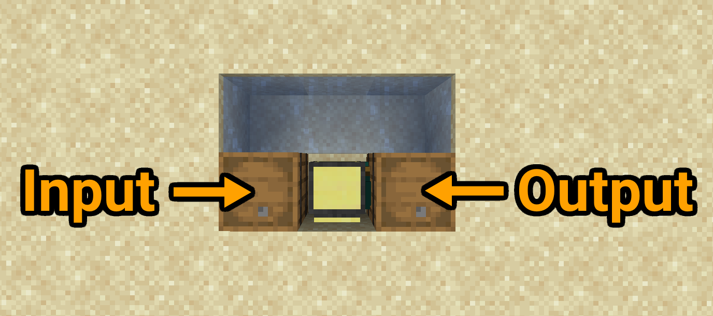

## Concrete Converter
This program controls a mining turtle that automatically grabs a stack of concrete powder from an inventory, converts it to concrete and puts it back into another inventory.  
As it only turns and doesn't move it doesn't consume any fuel.  
The inventory sides are freely configurable and this program works independent of the block type and how long it takes the block to convert so it can also be used for modded blocks that follow the same principle as vanilla concrete.

<br>



<br>

This setup is only an example, you can place the input and output inventories and water on any side of the turtle.

<br>

### Notes:
- In order for the turtle not to break on SP world rejoins or MP server restarts, the turtle keeps track of its orientation.  
  If you move the turtle to a new spot or rotate it while in the same spot, hold <kbd>Ctrl</kbd> + <kbd>T</kbd> then run the command `rm orientation.txt` and then break the turtle, place it on its new spot and open it once to start the program.
- Since the turtle only turns around and doesn't move, no fuel is needed.
- The turtle will only take one stack from the input at a time, but it will eventually take every single item you put in the input.
- Should the input inventory be empty, the turtle will wait and check every half second until you put something in.
- The input and output inventories can be on any side of the turtle, but the turtle will always place the blocks on its initial front side.

<br>

### Installation:
1. Craft a mining turtle (pickaxe) and two inventory blocks (chests, barrels, etc) and place them next to the turtle
2. Place a block of water so that it flows in front of the turtle in some way  
  Important: the turtle will need to face the block of water when it starts up, otherwise it will get stuck trying to pick up the input items
3. Place the mining turtle so that it faces the flowing water
4. Run these commands:
```
label set concrete_converter
pastebin get 8sbKSe4e startup.lua
edit startup.lua
```
5. Change the settings at the top of the file to match your setup, including inventory sides and how long it takes for the block to be converted
6. Press <kbd>Ctrl</kbd>, select `[Save]` and press <kbd>Enter</kbd>, then press <kbd>Ctrl</kbd> again, select `[Exit]` and press <kbd>Enter</kbd>  
7. Run the command `reboot` to start the program
