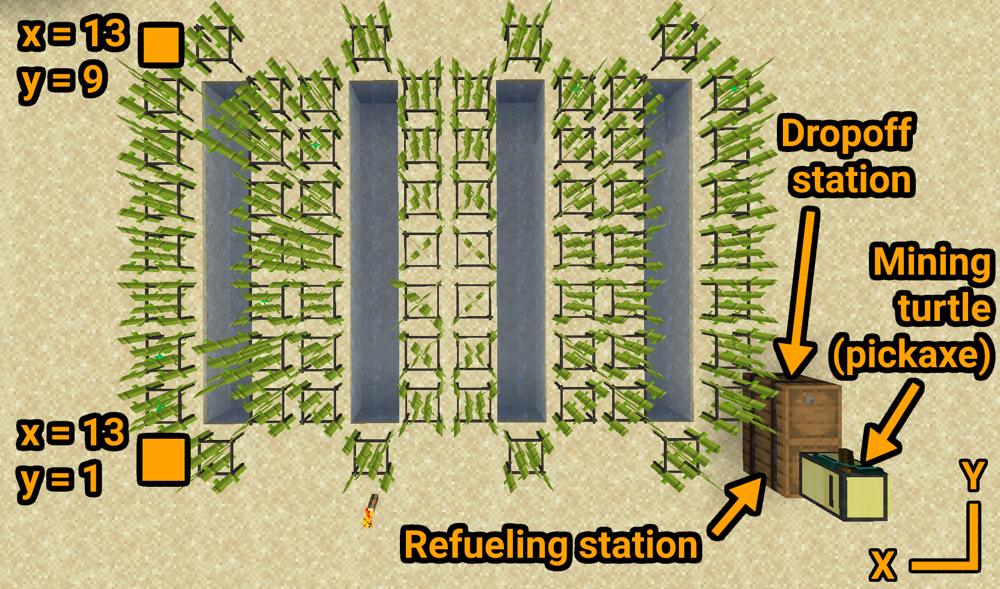

## Sugarcane Farm
This program controls a mining turtle to automatically harvest sugarcane and deposit it into a chest or barrel.  
It also refuels itself automatically.  
You can even use this same script for a cactus farm as they behave identically.  

<br>



<br>

### Notes:

- The farm can be of any size, as long as it's a rectangle
- The sugarcane can be in any pattern
- The turtle will break every block in the farm above and including a height of 2 blocks, so make sure there are no blocks there you don't want broken
- Make sure the entire row of the y axis that the barrels/chests are on is empty, as the turtle will move there to deposit the sugarcane
- Always keep the refueling station stocked or the turtle will eventually get stuck in the middle of a harvesting cycle
- You may open the turtle every now and again to see its stats, which it will print every time it refuels after finishing a harvesting cycle

<br>

### Installation:
1. Craft a mining turtle (pickaxe) and two chests or barrels and place them like shown in the image above  
  The positioning of the chests/barrels is important! The turtle will always assume the farm is in front of it and to the right, from its initial position
2. Place the mining turtle above the refueling station in the corner, facing along the left edge of the farm (X axis)
3. Run these commands:
```
label set sugarcane_farm
pastebin get xHQnQRay startup.lua
edit startup.lua
```
3. Change the settings at the top of the file to match your farm size, fuel item and growing speed (if you have a mod that changes the growing speed of sugarcane, like PneumaticCraft, which I used in the screenshot above)
  Just make sure the sugarcane doesn't grow faster than the turtle takes to move the full length in the X axis or it will get stuck!
4. Press <kbd>Ctrl</kbd>, select `[Save]` and press <kbd>Enter</kbd>, then press <kbd>Ctrl</kbd> again, select `[Exit]` and press <kbd>Enter</kbd>  
5. Now run the command `reboot` to automatically start the program
