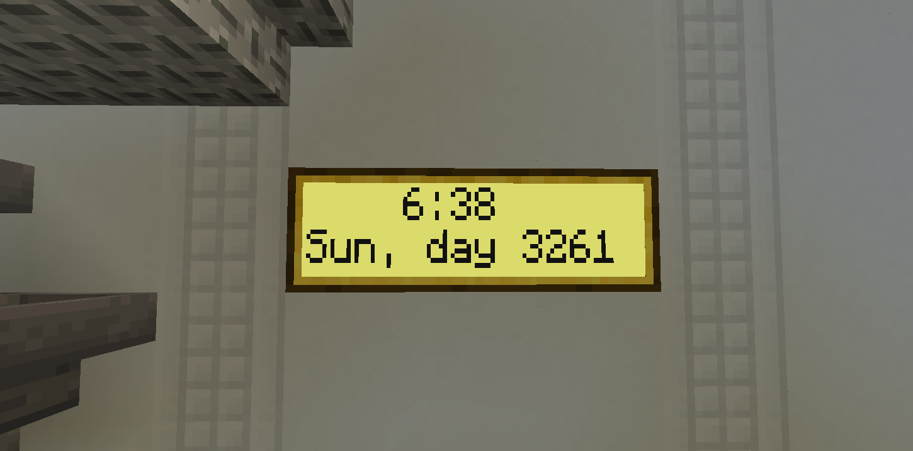
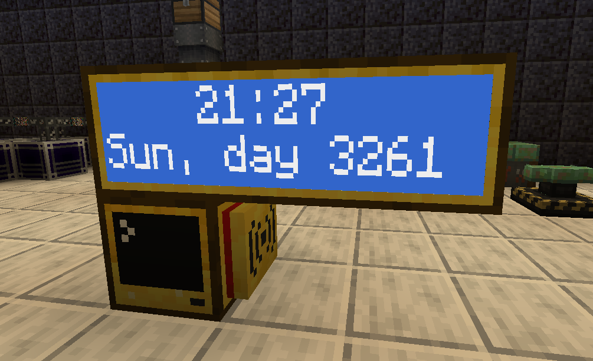

## NTP-Clock
A monitor-based digital NTP clock that displays the ingame time, day-of-week and number of days passed.

<br>


<br>


<br>

### Requirements:
- Advanced Computer
- Ender Modem
- 3 Advanced Monitors

<br>

### Install:
```lua
label set clock
pastebin get GJWjf9yW startup.lua
edit startup.lua
-- ^ Edit to change to 12h time format
reboot
```